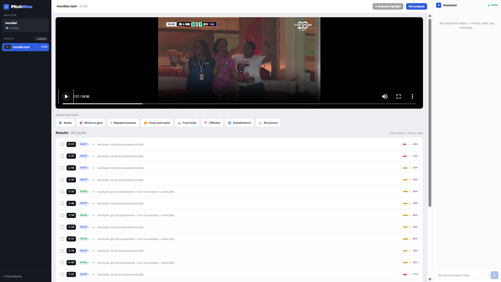

# PitchWise

Automated sports match analysis platform. Upload a game recording, let the computer
vision pipeline detect goals and shots, and query a streaming AI chat assistant for
coaching insights.



---

## Features

- **Video upload** — supports `.mp4`, `.mov`, `.mkv`, `.avi`
- **Auto-detection** — YOLOv8/YOLO11 (ONNX Runtime) + ByteTrack.NET detect players, ball,
  referee and goalkeeper; trajectory heuristics identify shots and goals
- **Live analysis** — point it at a YouTube/Twitch page or a direct HLS/RTMP stream and
  watch detection overlays on a low-latency HLS preview in the browser
- **Event timeline** — interactive results panel; clicking an event seeks the video player
  to that moment
- **AI chat** — streaming LLM assistant with full match context (works with OpenAI,
  Anthropic, or any OpenAI-compatible API including Ollama)
- **Manual tagging** — coaches can annotate custom events via the API
- **Highlight reels** — select events and stitch them into a single reel (ffmpeg, rendered
  in the background via a Redis queue)
- **Share links** — public, time-limited link to a highlight; the page streams (never
  downloads) and expired links return `410`
- **HLS delivery (CDN-style)** — reels are segmented to HLS and served by an nginx edge
  with signed, expiring URLs and edge caching; the API stays off the byte path
  (see [Highlight delivery](#highlight-delivery-hls-cdn-style))

---

## Architecture

The platform is split into independent services, **all .NET** — there is no Python
anywhere at runtime. The API and the worker communicate **only** through Redis (a job id)
and a shared PostgreSQL database (a single EF Core `AppDbContext`) — the API never calls
the vision code directly.

```
  Web (Next.js :3000)
        │  HTTP / SSE
        ▼
  .NET API (:8000)  ──LPUSH {"job_id":N}──►  Redis lists "vision_jobs" / "highlight_jobs"
        │                                          │ BRPOP
        │  read / write (EF Core)                  ▼
        └──────────────►  PostgreSQL  ◄── read / write (EF Core) ──  .NET worker
                          (sessions,                                 (worker-dotnet/):
                           events, jobs)                             PitchWise.Worker
                                                                       (batch: detect+track+
                                                                        events, highlights)
                                                                      PitchWise.Live (:8001)
                                                                       (WebSocket + HLS,
                                                                        live analysis)
```

- **Schema ownership** — the .NET API creates the database schema (EF Core
  `EnsureCreated`). The .NET worker only reads and writes; it never creates tables. Both
  sides share the same `AppDbContext`/entities (the worker project references the API
  project directly), so there's a single source of truth for the schema, not a
  cross-language contract to keep in sync.
- **Frontend** — talks to the API over the same `/api/...` paths on port 8000, with
  `snake_case` JSON and SSE for chat streaming. It talks to the live server (`:8001`)
  directly over a WebSocket for live analysis sessions, using a `ws_url` the API mints.

### Highlight delivery (HLS, CDN-style)

A coach selects events → the worker stitches a highlight reel (ffmpeg) and segments it
into HLS (`.m3u8` + `.ts`). Delivery follows the production model used by every large
streaming service: **the application server never serves video bytes.** An nginx edge
(standing in for a CDN) validates a signed, expiring URL and caches the segments; the
API only mints the URL and steps aside.

```
                        ┌──────────────────────────────────────────────┐
  Viewer (hls.js)       │  bytes: edge → viewer (cached), API off path  │
        │               └──────────────────────────────────────────────┘
        │ 1. GET signed HLS url
        ▼
  .NET API (:8000) ── mints signed url (HMAC-style secure_link, expiry) ──┐
        │  (JSON only, NO bytes)                                          │
        │                                                                 ▼
        │ 2. GET /hls/{id}/index.m3u8?md5=…&expires=…   ┌──────────────────────────┐
        └──────────────────────────────────────────────►  nginx edge (:8080)      │
                                                        │  • secure_link validates │
                                                        │    signature + expiry    │
                                                        │    (403 / 410, no API)   │
                                                        │  • proxy_cache: 1st=MISS │
                                                        │    rest=HIT (X-Cache hdr)│
                                                        └────────────┬─────────────┘
                                                        reads ./storage/hls (origin)
                                                                     ▼
                                                        worker writes segments here
```

- **Signed URLs** — the API computes an nginx `secure_link` signature
  (`md5(expires + /hls/{id}/ + secret)`); nginx validates it on every `.ts` **without
  contacting the API**. Bad signature → `403`, expired → `410`. One token authorizes the
  whole `/hls/{id}/` directory, so the player fetches segments autonomously.
- **Edge cache** — `proxy_cache` makes the first viewer a `MISS` (warms the edge) and
  every later viewer a `HIT` (`X-Cache-Status` header). The fan-out to many viewers of a
  shared link is absorbed at the edge; the API sees one request per viewer (the URL mint),
  never the bytes. A load script lives in [`loadtest/`](loadtest/hls_fanout.sh).
- **Player** — [`HlsPlayer`](web/components/HlsPlayer.tsx) uses hls.js (Chrome/Firefox),
  native HLS (Safari/iOS), and falls back to the plain MP4 `/stream` endpoint otherwise.
- **Next step (designed, not built)** — a rolling `EVENT` manifest appended as each event
  clip finishes, so viewers watch a highlight while it is still being assembled
  (near-real-time, the WSC-style "highlights in seconds" path).

| Layer | Technology |
|---|---|
| Frontend | Next.js 16, React 19, TypeScript, Tailwind CSS |
| API | ASP.NET Core 9, EF Core 9 (Npgsql), StackExchange.Redis |
| Worker | .NET 9 Worker Service, EF Core (shared `AppDbContext` with the API), StackExchange.Redis |
| Vision | ONNX Runtime (YOLOv8/YOLO11 export), [ByteTrack.NET](https://github.com/arturbuszka/ByteTrack.NET), OpenCvSharp, ffmpeg |
| Live | ASP.NET Core WebSockets, yt-dlp (stream URL resolve), ffmpeg (HLS encode) |
| LLM | OpenAI-compatible adapter (OpenAI, Anthropic, Ollama) |
| Queue | Redis (plain list, LPUSH/BRPOP) |
| Database | PostgreSQL |
| Video delivery | HLS (ffmpeg segmentation) + nginx edge (`secure_link`, `proxy_cache`), hls.js player |

---

## Running with Docker (recommended)

**Prerequisites:** Docker and Docker Compose.

```bash
# 1. Copy the example env file and fill in your LLM credentials
cp .env.example .env
#    LLM_PROVIDER=openai
#    LLM_API_KEY=sk-...
#    LLM_MODEL=gpt-4o-mini

# 2. Start all services (postgres, redis, api, worker, nginx edge, web)
docker compose up -d
```

The `worker` service is a single .NET container (built from
[`worker-dotnet/Dockerfile`](worker-dotnet/Dockerfile)) running both the batch worker and
the live WebSocket/HLS server — no Python image, no separate live-server container.

- Web app: http://localhost:3000
- API: http://localhost:8000
- Live WS/HLS server: http://localhost:8001
- HLS edge (nginx, serves video segments): http://localhost:8080

Uploaded videos and generated clips/HLS segments are persisted under the local
`./storage/` volume (`uploads/`, `clips/`, `hls/`).

> **AI chat needs LLM credentials passed to the `api` service.** The root `.env` is used
> by Compose for `${VAR}` interpolation only — it is **not** auto-injected into containers.
> The `api` service does not list `LLM_*` by default, so the chat assistant stays
> unconfigured (everything else — analysis, highlights, HLS, live — works without it). To
> enable chat, add to the `api.environment` block in `docker-compose.yml`:
> ```yaml
>       LLM_PROVIDER: "${LLM_PROVIDER}"
>       LLM_BASE_URL: "${LLM_BASE_URL}"
>       LLM_API_KEY: "${LLM_API_KEY}"
>       LLM_MODEL:   "${LLM_MODEL}"
> ```
> (keeps the key out of the committed yml; Compose pulls it from your gitignored `.env`.)

> **web → api connectivity (the `/api` proxy).** The browser calls the API via relative
> `/api/*` paths (same-origin, so no CORS), which Next's `rewrites()` proxy forwards to
> the API. Inside Compose the API is reachable as `http://api:8000` (service name), not
> `localhost`. Because `output: "standalone"` **bakes `rewrites()` at build time**, the
> destination is set via the `API_INTERNAL_URL` **build arg** (Compose passes
> `http://api:8000`; it defaults to `http://localhost:8000` for host dev). The same var is
> also a runtime env for server-side rendering. If you change it, rebuild the web image
> (`docker compose up -d --build web`) — a runtime-only change won't move the baked proxy.

> **HLS signing secret.** The `api` and `nginx` services share `HLS_SIGNING_SECRET`
> (default `devsecret`). For anything beyond local dev, set a strong value in `.env` —
> both services read `${HLS_SIGNING_SECRET}`, so the signatures stay in sync.

---

## Running locally (dev)

On Windows you can launch everything at once with the helper script, which starts the
infrastructure and opens the API, worker, and web in separate terminals:

```powershell
.\dev.ps1
```

Otherwise, start each piece manually:

### 1. Infrastructure (Postgres + Redis)

```bash
docker compose -f docker-compose.infra.yml up -d
```

### 2. .NET API (creates the schema, listens on :8000)

```bash
cd api-dotnet
dotnet run
```

Configured via environment variables or `appsettings.json` (the `App` section) — see
[Environment variables](#environment-variables) below.

### 3. .NET worker (vision batch) + live server

Two processes, both under [`worker-dotnet/`](worker-dotnet/):

```bash
cd worker-dotnet

# Point them at the same database and Redis as the API (Npgsql connection string,
# not the old asyncpg URL form)
export DATABASE_CONNECTION="Host=localhost;Port=5432;Database=pitchwise;Username=pitchwise;Password=pitchwise"
export REDIS_URL="redis://localhost:6379"
export YOLO_MODEL_PATH="$(pwd)/vision-onnx/football.onnx"   # + football.names.json alongside
export FFMPEG_PATH=/path/to/modern/ffmpeg                   # needs -hls_flags (ffmpeg >= 4)

dotnet run --project PitchWise.Worker -c Release   # batch: Redis BRPOP → detect+track+events
dotnet run --project PitchWise.Live -c Release      # live WS/HLS server, listens on :8001
```

See [Model setup](#model-setup) for where `football.onnx` comes from, and
[Environment variables](#environment-variables) for the full list of knobs
(`LIVE_PIPELINE_MODE`, `FRAME_STRIDE`, `MAX_WIDTH`, etc).

### 4. Frontend

```bash
cd web
npm install
npm run dev     # http://localhost:3000
```

In `npm run dev`, `rewrites()` is evaluated at runtime, so the `/api` proxy and SSR use
`API_INTERNAL_URL` (default `http://localhost:8000`) with no extra setup — the API on the
host is reached directly. (Under Compose this is set to `http://api:8000`; see the
web → api note above.)

### 5. HLS edge (optional, for highlight streaming)

The signed-URL HLS path needs the nginx edge. Running on the host, point it at the same
`./storage/hls` and use the same secret the API signs with (`HLS_SIGNING_SECRET`):

```bash
docker run --rm -p 8080:80 \
  -e HLS_SIGNING_SECRET=devsecret -e NGINX_ENVSUBST_FILTER=HLS_SIGNING_SECRET \
  -v "$PWD/storage/hls:/srv/hls:ro" \
  -v "$PWD/nginx/nginx.conf.template:/etc/nginx/templates/default.conf.template:ro" \
  nginx:1.27
```

Without it, the player falls back to the MP4 `/stream` endpoint, so highlights still play.

---

## Model setup

The detector runs an ultralytics-exported ONNX model (output `[1, 4+C, N]`, transposed,
no objectness — the YOLOv8/YOLO11 detection head; both export to the identical layout, so
one decoder ([`Yolo11OnnxDetector.cs`](worker-dotnet/PitchWise.Vision/Yolo11OnnxDetector.cs))
handles either). Two models ship pre-exported in `worker-dotnet/vision-onnx/`:

- **`football.onnx`** (default) — classes `player`/`ball`/`referee`/`goalkeeper`. Exported
  from the `yolov8m-640-football-players.pt` weights published by
  [Darkmyter/Football-Players-Tracking](https://github.com/Darkmyter/Football-Players-Tracking)
  (Google Drive link in their README; trained on the Roboflow
  `football-players-detection` dataset). Fetching that dataset's weights directly via the
  Roboflow SDK does **not** work — `model.weights_path` is `None` for this project, it's
  a dataset+hosted-inference project, not one with downloadable weights.
- **`yolo11n.onnx`** (fallback) — plain COCO (`person`/`sports ball` only). Detects
  *everyone in frame*, stadium crowd included — COCO has no notion of "player vs
  spectator". Useful only for a quick pipeline smoke test without downloading anything.

To (re-)export a model, or add a different one — this needs Python **once**, as a
throwaway build step; nothing at runtime depends on it:

```bash
cd worker-dotnet/vision-onnx
python -m venv .venv
.venv/Scripts/python.exe -m pip install ultralytics onnx onnxruntime
.venv/Scripts/python.exe export_and_golden.py \
    --model <your-model>.pt --video <a-clip.mp4> --imgsz 640 --frames 0,25,50
```
This writes `<model>.onnx` + `golden_<model>.json` (a parity oracle). Also write/copy a
class-names sidecar `<model>.names.json` (`{"names": {"0": "ball", ...}}` or flat
`{"0": "ball", ...}`) next to the `.onnx`. Delete `.venv` when you're done.

**Verify parity** against ultralytics (proves the C# pre/post-processing matches):
```bash
cd worker-dotnet
dotnet run --project PitchWise.Vision.ParityTest -c Release -- \
    --onnx vision-onnx/football.onnx --golden vision-onnx/golden_football.json \
    --video <a-clip-with-close-up-players.mp4>
```
Note: the football model needs footage where players are reasonably large in frame — it
was trained on 38 close-up images, so wide stadium shots can yield near-zero confidence.

**Full pipeline smoke** (detect → track → events on a clip):
```bash
dotnet run --project PitchWise.Vision.Smoke -c Release -- \
    --onnx vision-onnx/football.onnx --golden vision-onnx/golden_football.json \
    --video <short-clip.mp4> --stride 5
```

---

## Environment variables

Copy `.env.example` to `.env` and adjust as needed.

| Variable | Description | Default |
|---|---|---|
| `LLM_PROVIDER` | LLM backend label | `openai` |
| `LLM_BASE_URL` | OpenAI-compatible endpoint | `https://api.openai.com/v1` |
| `LLM_API_KEY` | API key (empty for Ollama; empty also disables live tactical tips) | — |
| `LLM_MODEL` | Model name | `gpt-4o-mini` |
| `DATABASE_CONNECTION` | Npgsql connection string, shared by the API and the worker | local Postgres |
| `REDIS_URL` | Redis connection (`host:port` or `redis://host:port`, both accepted) | `redis://localhost:6379` |
| `VISION_QUEUE` | Redis list name for analysis jobs | `vision_jobs` |
| `HIGHLIGHT_QUEUE` | Redis list name for highlight-render jobs | `highlight_jobs` |
| `FRAME_STRIDE` | Batch analysis: process every Nth frame (higher = faster, less accurate) | `3` |
| `GENERATE_CLIPS` | `1`/`true` to extract a clip per detected event | off |
| `CLIP_PRE_SECONDS` / `CLIP_POST_SECONDS` | Seconds of footage before/after a detected event in a clip | `6` / `4` |
| `YOLO_MODEL_PATH` | Path to the exported ONNX model (worker + live) | `models/football.onnx` |
| `YOLO_NAMES_PATH` | Class-names sidecar override | *(derived: `<model>.names.json`)* |
| `LIVE_IMGSZ` | Model input size — must match the export | `640` |
| `LIVE_PIPELINE_MODE` | Live server: `detect` (YOLO + overlay) or `passthrough` (raw frames, no analysis) | `detect` |
| `LIVE_HLS_DIR` | Where live sessions write HLS segments | OS temp dir `/live_hls` |
| `MAX_WIDTH` | Live: downscale cap for the encoded stream | `1280` |
| `FFMPEG_PATH` | ffmpeg binary — see the "old ffmpeg" note below | `ffmpeg` |
| `YT_DLP_PATH` | yt-dlp binary — resolves YouTube/Twitch page URLs to a direct stream | `yt-dlp` |
| `STORAGE_DIR` | Root directory for uploads, clips, and HLS segments | `/app/storage` |
| `WEB_ORIGIN` / `WEB_ORIGIN_ALT` | Allowed CORS origins (API and live server) | `http://localhost:3000` / `:3001` |
| `API_INTERNAL_URL` | Where the web `/api` proxy + SSR reach the API (build arg **and** runtime env; Compose sets `http://api:8000`) | `http://localhost:8000` |
| `LIVE_WORKER_URL` | Where the API points the frontend for live WS/HLS | `http://localhost:8001` |
| `HLS_SIGNING_SECRET` | Shared secret for nginx `secure_link` signatures (set on **both** `api` and `nginx`) | `devsecret` |
| `HLS_BASE_URL` | Browser-facing base URL of the nginx HLS edge | `http://localhost:8080` |
| `HLS_LINK_TTL_SECONDS` | Lifetime of a signed HLS URL | `3600` |

**Old ffmpeg on PATH**: on Windows dev boxes it's common to have an ancient ffmpeg
earlier on PATH (e.g. a game-engine-bundled build from 2013) that doesn't support
`-hls_flags` — HLS encoding silently breaks. Point `FFMPEG_PATH` at a modern build
(ffmpeg >= 4.x). `dev.ps1` does this automatically via the winget-installed package.

**Windows apphost gotcha**: running a published `.dll` directly (`dotnet
PitchWise.Live.dll`) can load `C:\Windows\System32\onnxruntime.dll` (an OS-bundled
Windows ML component) ahead of the NuGet-restored one, crashing with `version [14] not
supported`. `dotnet run` (what `dev.ps1` uses) doesn't hit this — the Docker image's
`CMD` runs the native apphost binaries instead of `dotnet foo.dll` for the same reason.

**CDN segment extensions**: some CDNs serve HLS segments behind non-standard extensions
(`.png`, `.ts.m3u8`, signed query strings). ffmpeg's HLS demuxer rejects those by default;
the live server sets `OPENCV_FFMPEG_CAPTURE_OPTIONS=allowed_extensions;ALL|...` before
opening a source stream to allow them. If a stream still won't open after that, the
source itself is usually rejecting the request (403 — an expired or session-bound token,
not fixable client-side); probe with `ffmpeg -i <url>` directly to confirm.

---

## Project structure

```
pitchwise/
├── api-dotnet/             # ASP.NET Core REST API (schema owner, queue producer)
│   ├── Controllers/        # analyses, videos, events, chat (SSE), highlights, share, live
│   ├── Models/             # EF Core entities + enums
│   ├── Data/               # AppDbContext, enum ↔ string mappings
│   ├── Migrations/         # dev SQL for columns EnsureCreated won't add to an existing DB
│   └── Services/           # VisionQueue + HighlightQueue (Redis), HlsSigner, LlmClient
├── worker-dotnet/          # .NET worker: vision pipeline + batch queue + live server
│   ├── PitchWise.Vision/   # detect (ONNX) + track (ByteTrack.NET) + events + ffmpeg + overlay/homography
│   ├── PitchWise.Worker/   # BackgroundService: Redis BRPOP → analyze/highlight → EF Core
│   ├── PitchWise.Live/     # ASP.NET Core: WebSocket live analysis + HLS serving (:8001)
│   ├── PitchWise.Vision.ParityTest/  # detection parity vs an ultralytics golden reference
│   ├── PitchWise.Vision.Smoke/       # full-pipeline E2E smoke on a video
│   ├── vision-onnx/        # export_and_golden.py + exported .onnx models + goldens
│   └── Dockerfile          # multi-stage: publishes worker+live, ffmpeg+yt-dlp, no Python
├── nginx/                  # CDN-style HLS edge (secure_link + proxy_cache)
├── web/                    # Next.js frontend (App Router)
├── loadtest/                # HLS fan-out load script (prove the edge absorbs traffic)
├── docker-compose.yml      # full stack (incl. nginx HLS edge)
├── docker-compose.infra.yml# Postgres + Redis only (for local dev)
└── dev.ps1                 # Windows dev launcher
```

---

## Smoke test

With the API running:

```bash
# health
curl http://localhost:8000/api/health

# event types (static config)
curl http://localhost:8000/api/event-types

# create an analysis
curl -X POST http://localhost:8000/api/analyses \
  -H "Content-Type: application/json" \
  -d '{"name":"Test","sport":"football"}'
```

For the vision pipeline and live server, see [Model setup](#model-setup) above.

---

## License

[MIT](LICENSE)
